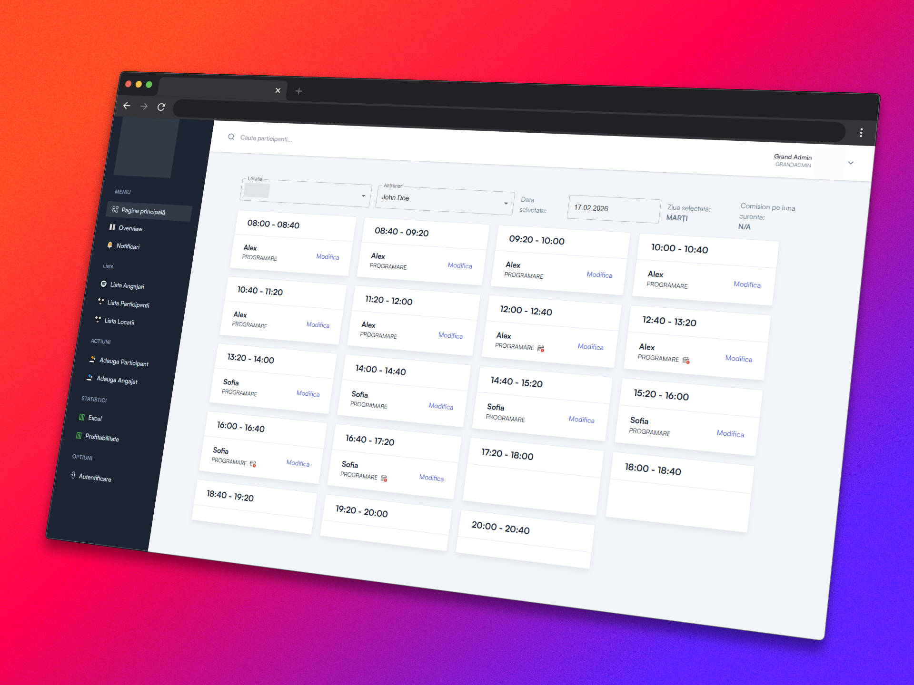

*⚠️ Note: The source code for this project is proprietary and under NDA. This repository documents the technical challenges, architecture, and performance optimizations we implemented.*

# From Excel Chaos to Cloud Control: Scaling a Swimming Franchise to 10 Locations

**Role:** Full Stack Developer | **Timeline:** 10 Months | Team Size: 2 | **Status:** Live

### Built With

---

## 1. The Challenge: Drowning in Spreadsheets

As the franchise expanded to **10 locations**, their manual operations hit a breaking point. Relying on fragmented Excel sheets and paper logs created a logistical nightmare for headquarters.

The business was facing three critical issues:

* **Data Silos:** Client data was trapped in local files at each branch. HQ had no real-time view of total revenue or active enrollments.
* **Risk of Scheduling Conflicts:** Without a centralized validation system, there was a high risk of double-booking lanes and instructors.
* **High Administrative Overhead:** Location managers dedicated significant time to manually reconciling payments and organizing instructor shifts.

They needed a system that could handle complex logistics while remaining simple enough for instructors to use with wet hands poolside.

---

## 2. The Solution: A Multi-Tenant Cloud Platform

We engineered a custom cloud-native web application designed to centralize operations while respecting the hierarchy of a franchise model.

### Granular Role-Based Access Control (RBAC)

The core technical challenge was managing permissions across multiple locations. We implemented a strict hierarchy to ensure data security and operational clarity:

1. **Super Admin (HQ):** Complete "God-mode" visibility. Can access all 10 locations, view global revenue reports, and manage system-wide settings.
2. **Location Managers:** Full autonomy over their specific branch’s schedule and staff, but strictly walled off from other locations' data.
3. **Team Leaders:** A specialized middle-management role for senior coaches to manage their specific sub-teams and shift assignments.
4. **Instructors:** A simplified, read-only view to check their own appointments and track attendance.

### Conflict-Resolution Engine

To mitigate scheduling conflicts, we developed a real-time validation engine. When a booking is initiated, the system cross-references multiple constraints simultaneously:

*   **Instructor Availability:** Checks against assigned shifts, approved time-off, and concurrent classes.
*   **Lane & Pool Capacity:** Ensures the requested time slot for a specific lane is free.

---

## 3. The Tech Stack

The application was built for performance and scalability, ensuring it runs smoothly on both office desktops and poolside tablets.

* **Frontend:** `Next.js` `Tailwind CSS` (Chosen for rapid UI development and responsive design).
* **Backend:** `Nest.js` (Chosen for its strict modular architecture, allowing us to decouple the complex Scheduling Module from the Auth System, making the code maintainable and testable).
* **Database:** `MongoDB` (Selected for its flexibility and performance).

---

## 4. The Results

The digital transformation moved the franchise from reactive fire-fighting to proactive growth.

* **100% Elimination of Double-Bookings:** The smart engine successfully blocks conflicting appointments, saving the front desk estimated hours of dispute resolution per week.
* **Real-Time Global Visibility:** HQ can now pull a "Global Revenue Report" in seconds—a process that previously took days of compiling spreadsheets from 10 different branches.
* **Multi-Tenant Scalability:** Engineered the schema to be **tenant-agnostic**, allowing HQ to deploy a new location instance in under 5 minutes without code changes or server restarts.

